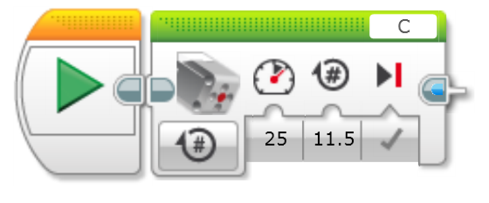

# Action > Medium Motor

## Overview
The medium motor block is most obviously used to connect to the medium motor. Do not attempt to use this with one of the larger motors.

1. Port Selection

    This is used to tell the Control Brick which port to send the command to. Motors must be plugged into the lettered ports (A, B, C, D). If you change the physical cable location in your robot, make sure you update these blocks.

    The last option other than a letter looks like the port port connection on the Control Brick. If you select this option, it will add a new 'Port' option on the code block right before the option labeled as 3 in the above image. This allows you to pass in the port letter from the output of a Data Operation block.

2. Action Selection

   The action selection is used to choose what action you want the medium motor to perform. Currently it has five options.

   - Off : Used to stop the motor

   - On : Turns on the motor. The motor will keep running until a future block tells it to stop

   - On for Seconds : Turns on the motor for a specified number of seconds. The time is controlled by another setting on the code block. The motor will stop or continue after the time based off another setting on the code block

   - On for Degrees: Turns on the motor for a number of degrees of a rotation. A rotation is one complete 360 degree change of the motor.The motor will stop or continue after the time based off another setting on the code block

   - On for Rotations: Turns on the motor for a specified number of rotations. This can be fractions of a rotation. The motor will stop or continue after the time based off another setting on the code block

3. Power Parameter

   Sets the amount of power to use when turning the motor. Higher power means faster rotations. Valid values would -100 to 100. Negative power turns the motor in the opposite rotation

4. Counter Parameter

   This next setting changes based off the `Action Selection`. 
   - When the action is **On for Seconds** then the counter is the number of seconds to execute the action. 
   - When the action is **On for Rotations** then the counter is the number of rotations to execute. This can be a decimal such as **1.5** seconds.
   - When the action is **On for Defrees** then the counter represents the degrees. Can be 0 to 360 to turn one way, and 0 to -360 to turn the opposite 

5. Break Parameter

   Tells the robot to stop the motor after completing the `Action Selection` for the number of time the `Counter` is set to.

    Two options:

   - Brake - Applies the brake upon completion of the action

        

   - Coast - Lets the motor coast to a stop

        

   This parameter is missing when you set `Action Selection` to 'On' since that action is meant to turn the motor on and move to the next block. It is the only parameter when you set the `Action Selection` to 'Off'.

## Examples

### Turn on medium motor on port A at 80 percent power

   

### Turn on medium motor on port A at 75 percent power for 5 seconds

   

### Reverse on medium motor on port C at 75 percent power for 90 degress

   

### Reverse on medium motor on port C at 25 percent power for 11.5 rotations

   

